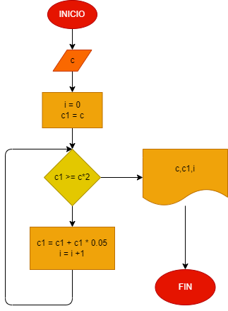

# Hacer el diagrama de flujo y el codigo en python, que lea un capital "c", y que averigue y imprima en cuantos meses se duplica, si lo colocamos a un interes compuesto de 5% mensual.

## Análisis.
 c = 1000
 i = 0
 

## Diagrama de flujo.

